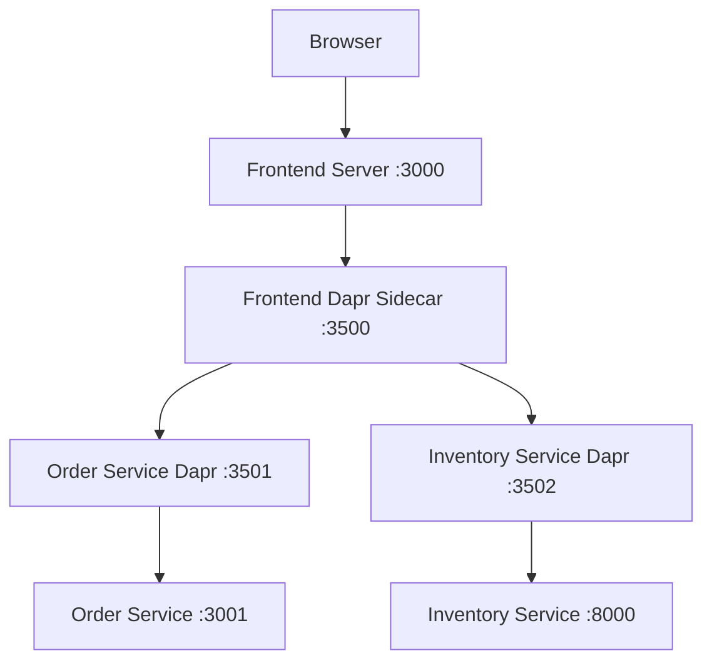

# Frontend Dapr Integration Architecture

## Summary
Updated the frontend React application to use Dapr service invocation through a Node.js/Express server proxy, ensuring full Dapr integration across all services.

## Architecture Overview

### Before: Static React App
- React app served by nginx
- Direct HTTP calls to backend services
- No Dapr integration for frontend

### After: Dapr-Enabled Frontend Server
- React app served by Node.js/Express server
- Frontend server has Dapr sidecar
- API calls proxied through Dapr service invocation
- Full Dapr integration across all services

## Implementation Details

### 1. Frontend Server (`src/frontend/server/`)
**New Node.js/Express server** that:
- Serves the built React application
- Provides API proxy endpoints (`/api/proxy/*`)
- Communicates with backend services via Dapr
- Has its own Dapr sidecar (app-id: `frontend`)

**Key Features:**
```javascript
// Proxy to order service via Dapr
app.use('/api/proxy/orders', async (req, res) => {
  const response = await axios({
    method: req.method,
    url: `${DAPR_BASE_URL}/order-service/method/api/orders${req.path}`,
    data: req.body
  });
  res.json(response.data);
});
```

### 2. React API Client (`src/frontend/src/services/api.ts`)
**Updated to use proxy endpoints:**
- `inventoryApi.getProducts()` → `GET /api/proxy/inventory`
- `orderApi.createOrder()` → `POST /api/proxy/orders`
- All calls go through the frontend server proxy

### 3. Infrastructure Changes
**Container Apps Configuration:**
- Frontend now has Dapr enabled (`dapr.enabled: true`)
- App ID: `frontend`
- App Port: `3000` (Node.js server)
- Inventory service back to `external: false` (Dapr-only access)

### 4. Docker Configuration
**Updated Dockerfile:**
- Multi-stage build: React build → Node.js server
- Includes server dependencies
- Exposes port 3000
- Health check at `/health`

**Updated docker-compose:**
- Frontend service with Dapr sidecar
- Proper Dapr configuration
- Component and config volume mounts

## Communication Flow



### Request Example
1. Browser: `GET /api/proxy/orders`
2. Frontend Server: `GET http://localhost:3500/v1.0/invoke/order-service/method/api/orders`
3. Frontend Dapr → Order Service Dapr → Order Service
4. Response flows back through the same chain

## Development Setup

### Local Development with Dapr
```bash
# Option 1: Using docker-compose (recommended)
docker-compose up

# Option 2: Using Dapr CLI
cd src/frontend
./start-with-dapr.sh    # Linux/Mac
start-with-dapr.bat     # Windows
```

### Environment Variables
```bash
# Frontend server
PORT=3000
DAPR_HTTP_PORT=3500
NODE_ENV=development

# React app (empty for proxy)
REACT_APP_API_URL=
```

## Benefits of This Architecture

### ✅ Full Dapr Integration
- All services (including frontend) use Dapr
- Consistent service discovery and communication
- Unified observability and monitoring

### ✅ Dapr Features Available
- **Service Invocation**: Automatic retry, circuit breaker
- **Observability**: Distributed tracing across all calls
- **Security**: mTLS between all services
- **Resilience**: Built-in retry and timeout policies

### ✅ Development Consistency
- Same communication patterns in dev and production
- Easier testing of service interactions
- Simplified configuration management

## File Structure
```
src/frontend/
├── server/
│   ├── package.json          # Server dependencies
│   └── server.js             # Express server with Dapr proxy
├── src/
│   └── services/
│       └── api.ts            # Updated to use proxy endpoints
├── Dockerfile                # Multi-stage build
├── start-with-dapr.sh       # Development script
└── .env.example             # Environment configuration
```

## Deployment Notes

### Azure Container Apps
- Frontend container app has Dapr enabled
- All services communicate via Dapr service invocation
- Inventory service can be internal-only (no external ingress needed)

### Local Development
- Use docker-compose for full environment
- Or use Dapr CLI with individual service startup
- Frontend accessible at `http://localhost:3000`

This architecture ensures that Dapr is used consistently across all services while maintaining the benefits of a modern React frontend application.
